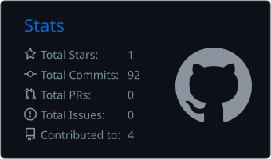
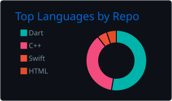

# Muhammad Axmadaliyev

Hello, I'm Muhammad, a mobile developer focused on Flutter and native iOS development.

I build production mobile applications for fintech, EdTech, transportation, logistics and corporate products. My apps have served 1,000,000+ users and reached #1 in the Finance category on both Google Play and the App Store. I care about clean architecture, app stability and measurable business results.

### Areas of Focus

- **Mobile Development:** Building cross-platform applications for Android and iOS using Flutter and Dart.
- **Native iOS:** Creating native features with Swift and SwiftUI, including WidgetKit widgets and Live Activities.
- **Real-time and Offline:** Working with REST APIs, WebSockets and offline-first data synchronization.
- **Payments and Authentication:** Integrating Apple Pay, Payme, Sign in with Apple and Google OAuth.
- **Development Tools:** Working with Git, Firebase and CI/CD pipelines on GitHub Actions.

### Tech Stack

- **Languages:** Dart, Swift, Java, C++
- **Mobile:** Flutter, SwiftUI, UIKit, WidgetKit, Live Activities, Platform Channels
- **State Management:** BLoC, Cubit, Riverpod, Provider
- **API and Database:** REST API, WebSocket, GraphQL, Chopper, Dio, Firebase, Drift, Supabase
- **Architecture:** Clean Architecture, SOLID, KISS, DRY
- **Tools:** Git, GitHub Actions, Xcode, Android Studio, Postman, Jira

### Experience

- [**Yunix Taxi**](https://yunix.uz) - iOS and Flutter Developer. Rider app with real-time driver tracking, Yandex Maps, WidgetKit and Live Activities.
- [**pDaftar**](https://pdaftar.uz) - Flutter Developer. Finance management platform for small businesses, ranked #1 in Finance on both stores.
- [**Ustoz AI**](https://ustoz.ai) - Flutter Developer. Educational platform with 1M+ users, crash-free rate raised from 30% to 78%.
- [**eXodim**](https://exodim.uz) - Flutter Developer. Corporate platform with 1C integration, attendance tracking and QR onboarding.
- **ISM International Group** - Flutter Developer. ELD application for commercial truck drivers.

### Projects

- [**Watchdog**](https://pub.dev/packages/watchdog): open-source Dart and Flutter package for inspecting network requests, routes, instances and error logs of a running app from the browser.
- **MilliyWay POS:** desktop point-of-sale system built with Flutter Desktop, with serial-port hardware and thermal printer integration.

### GitHub Metrics

### Contact

You can contact me through the links below:

[Telegram](https://t.me/muhammad_akhmadaliyev) • [LinkedIn](https://linkedin.com/in/muhammad-axmadaliyev) • [Email](mailto:akhmadaliyev17x@gmail.com) • [GitHub](https://github.com/Akhmadaliyev17x)
